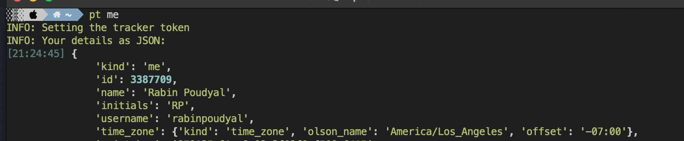
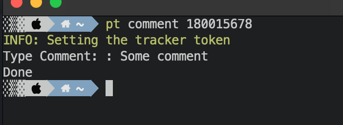

# It uses an pivotal tracker api and does lot of cool stuffs like creating tickets.

## Installing the app
```python
pip install pt-cli
```

## Add config file
You can find the token and ids in the tracker dashboard. For PERSON_ID, you might need to inspect json in network tab.
Create a file `~/.pt.yml` and add the following content.

```yml
pt:
  PIVOTAL_TRACKER_API_TOKEN: <token>
  PROJECT_ID: <id>
  PERSON_ID: <id>
```

### About you



### Create stories


### Index view / view all stories


### Show individual story


### Add Comment



### Labels


### Notifications


# Contributing

## Installation

```
$ pip install setup.py
```

## Development

This project includes a number of helpers in the `Makefile` to streamline common development tasks.

### Environment Setup

The following demonstrates setting up and working with a development environment:

```
### create a virtualenv for development

$ make virtualenv

$ source env/bin/activate


### run pt cli application

$ pt --help


### run pytest / coverage

$ make test
```

